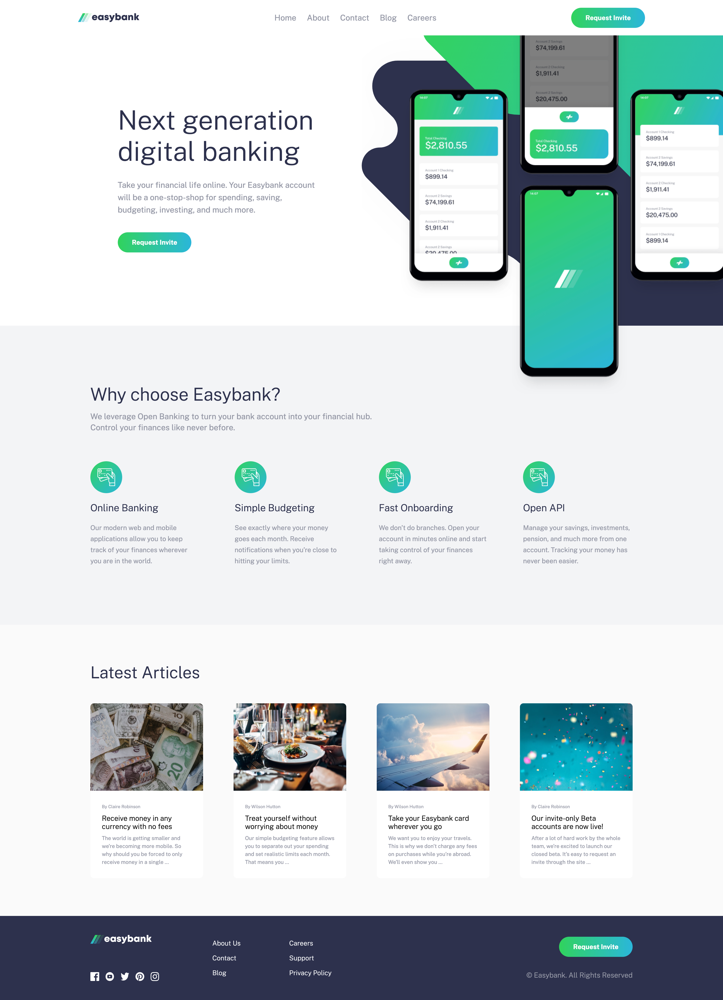

# Frontend Mentor - Easybank landing page solution

This is a solution to the [Easybank landing page challenge on Frontend Mentor](https://www.frontendmentor.io/challenges/easybank-landing-page-WaUhkoDN). Frontend Mentor challenges help you improve your coding skills by building realistic projects. 

## Table of contents

- [Overview](#overview)
  - [The challenge](#the-challenge)
  - [Screenshot](#screenshot)
  - [Links](#links)
- [My process](#my-process)
  - [Built with](#built-with)
  - [What I learned](#what-i-learned)
  - [Continued development](#continued-development)
  - [Useful resources](#useful-resources)
- [Author](#author)

**Note: Delete this note and update the table of contents based on what sections you keep.**

## Overview

### The challenge

Users should be able to:

- View the optimal layout for the site depending on their device's screen size
- See hover states for all interactive elements on the page

### Screenshot




### Links
- Solution URL: [Solution](https://github.com/danielbrah/easybank-landing-page)
- Live Site URL: [Live site](https://easybank-landing-page-danielbrah.netlify.app/)

## My process

### Built with

- Semantic HTML5 markup
- SCSS
- Flexbox
- JavaScript
- Mobile-first workflow

### What I learned

I learned how intersection observer works for JavaScript. It was quite simple to understand. 

```js
const observer = new IntersectionObserver((entries, observer) =>{
    entries.forEach(entry => {

        if (entry.isIntersecting)
        {
            console.log('Executed')
            Array.from(entry.target.children).forEach((entry, number) =>{
                entry.style.transitionDelay = `${(number / 4) - 0.05}s`
                entry.classList.toggle('active')
            })

            observer.unobserve(entry.target)
        }
    })
})
```

### Continued development

I want to learn DOM a little bit more so I can get comfortable with it.


### Useful resources

- [Kevin Powell's intro to Intersection Observation API](https://youtu.be/T8EYosX4NOo) - This video by Kevin Powell helped me with the basics of using the Intersection Observation API. 
- [MDN Docs](https://developer.mozilla.org/en-US/docs/Web) - I used this resource a lot to help jog my memory on CSS properties and their syntaxes. 

## Author
- Frontend Mentor - [@danielbrah](https://www.frontendmentor.io/profile/danielbrah)
- GitHub - [@danielbrah](https://github.com/danielbrah)
